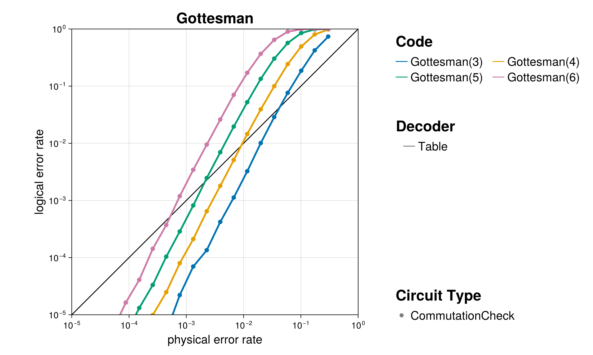

+++
title = "The Code Family `Gottesman`"
+++

# The Code Family `Gottesman`

The `[[2ʲ, 2ʲ - j - 2, 3]]` family of codes, the quantum equivalent of the Hamming codes, capable of correcting any single-qubit error.

@@card
@@card-header
References
@@
@@card-body
[ECC Zoo entry](https://errorcorrectionzoo.org/c/quantum_hamming)~~~ ~~~
[QuantumClifford.jl docs](https://quantumsavory.github.io/QuantumClifford.jl/dev/ECC_API/#QuantumClifford.ECC.Gottesman)
@@
@@

## A Few Examples from this Family

@@small
Click on the &#9654; marker to expand
@@

~~~

~~~
### Gottesman(3)
~~~

~~~

#### Parity Check Tableau

.png)

#### Encoding Circuit

@@small
can be generated with [`QuantumClifford.naive_encoding_circuit`](https://quantumsavory.github.io/QuantumClifford.jl/dev/ECC_API/#QuantumClifford.ECC.naive_encoding_circuit)
@@

_encoding.png)

<!-- TODO: Make QASM download for naive encoding circuit -->

#### Naive Syndrome Extraction Circuit

@@small
can be generated with [`QuantumClifford.naive_syndrome_circuit`](https://quantumsavory.github.io/QuantumClifford.jl/dev/ECC_API/#QuantumClifford.ECC.naive_syndrome_circuit)
@@

_naive_syndrome.png)

<!-- TODO: Make QASM download for naive syndrome circuit -->

<!-- #### Shor Syndrome Extraction Circuit -->

<!-- @@small -->
<!-- can be generated with [`QuantumClifford.shor_syndrome_circuit`](https://quantumsavory.github.io/QuantumClifford.jl/dev/ECC_API/#QuantumClifford.ECC.shor_syndrome_circuit) -->
<!-- @@ -->

<!-- TODO: Make QASM download for Shor syndrome circuit -->

~~~

~~~

~~~

~~~
### Gottesman(4)
~~~

~~~

#### Parity Check Tableau

.png)

#### Encoding Circuit

@@small
can be generated with [`QuantumClifford.naive_encoding_circuit`](https://quantumsavory.github.io/QuantumClifford.jl/dev/ECC_API/#QuantumClifford.ECC.naive_encoding_circuit)
@@

_encoding.png)

<!-- TODO: Make QASM download for naive encoding circuit -->

#### Naive Syndrome Extraction Circuit

@@small
can be generated with [`QuantumClifford.naive_syndrome_circuit`](https://quantumsavory.github.io/QuantumClifford.jl/dev/ECC_API/#QuantumClifford.ECC.naive_syndrome_circuit)
@@

_naive_syndrome.png)

<!-- TODO: Make QASM download for naive syndrome circuit -->

<!-- #### Shor Syndrome Extraction Circuit -->

<!-- @@small -->
<!-- can be generated with [`QuantumClifford.shor_syndrome_circuit`](https://quantumsavory.github.io/QuantumClifford.jl/dev/ECC_API/#QuantumClifford.ECC.shor_syndrome_circuit) -->
<!-- @@ -->

<!-- TODO: Make QASM download for Shor syndrome circuit -->

~~~

~~~

~~~

~~~
### Gottesman(5)
~~~

~~~

#### Parity Check Tableau

.png)

#### Encoding Circuit

@@small
can be generated with [`QuantumClifford.naive_encoding_circuit`](https://quantumsavory.github.io/QuantumClifford.jl/dev/ECC_API/#QuantumClifford.ECC.naive_encoding_circuit)
@@

_encoding.png)

<!-- TODO: Make QASM download for naive encoding circuit -->

#### Naive Syndrome Extraction Circuit

@@small
can be generated with [`QuantumClifford.naive_syndrome_circuit`](https://quantumsavory.github.io/QuantumClifford.jl/dev/ECC_API/#QuantumClifford.ECC.naive_syndrome_circuit)
@@

_naive_syndrome.png)

<!-- TODO: Make QASM download for naive syndrome circuit -->

<!-- #### Shor Syndrome Extraction Circuit -->

<!-- @@small -->
<!-- can be generated with [`QuantumClifford.shor_syndrome_circuit`](https://quantumsavory.github.io/QuantumClifford.jl/dev/ECC_API/#QuantumClifford.ECC.shor_syndrome_circuit) -->
<!-- @@ -->

<!-- TODO: Make QASM download for Shor syndrome circuit -->

~~~

~~~

~~~

~~~
### Gottesman(6)
~~~

~~~

#### Parity Check Tableau

.png)

#### Encoding Circuit

@@small
can be generated with [`QuantumClifford.naive_encoding_circuit`](https://quantumsavory.github.io/QuantumClifford.jl/dev/ECC_API/#QuantumClifford.ECC.naive_encoding_circuit)
@@

_encoding.png)

<!-- TODO: Make QASM download for naive encoding circuit -->

#### Naive Syndrome Extraction Circuit

@@small
can be generated with [`QuantumClifford.naive_syndrome_circuit`](https://quantumsavory.github.io/QuantumClifford.jl/dev/ECC_API/#QuantumClifford.ECC.naive_syndrome_circuit)
@@

_naive_syndrome.png)

<!-- TODO: Make QASM download for naive syndrome circuit -->

<!-- #### Shor Syndrome Extraction Circuit -->

<!-- @@small -->
<!-- can be generated with [`QuantumClifford.shor_syndrome_circuit`](https://quantumsavory.github.io/QuantumClifford.jl/dev/ECC_API/#QuantumClifford.ECC.shor_syndrome_circuit) -->
<!-- @@ -->

<!-- TODO: Make QASM download for Shor syndrome circuit -->

~~~

~~~

## Performance of Specific Decoders

TODO
