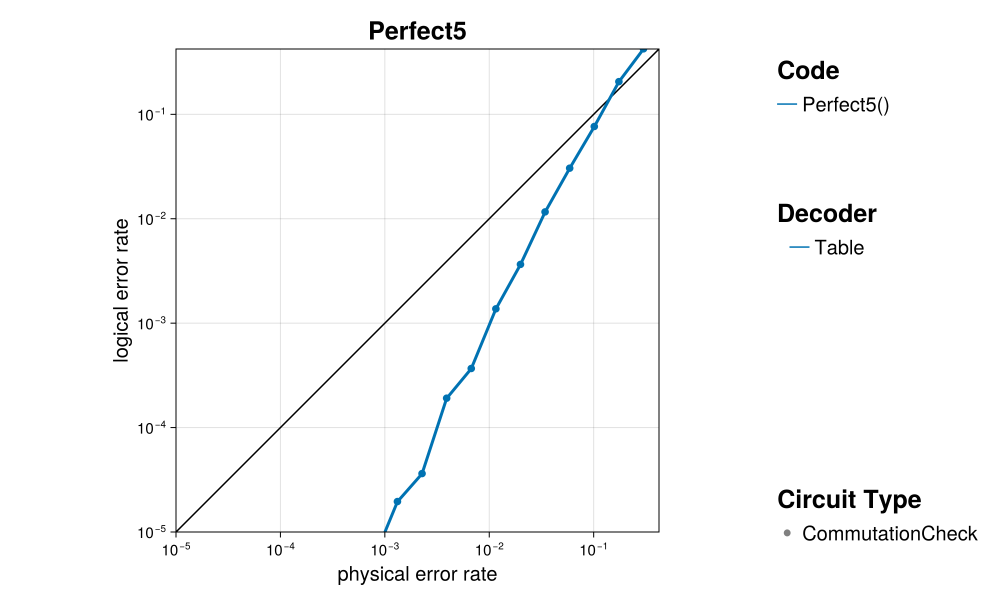

+++
title = "The Code Family `Perfect5`"
+++

# The Code Family `Perfect5`

One of the earliest proof-of-concept error correcting codes. The smallest code that can protect against any single-qubit error. Not a CSS code.

@@card
@@card-header
References
@@
@@card-body
[ECC Zoo entry](https://errorcorrectionzoo.org/c/stab_5_1_3)~~~ ~~~
[QuantumClifford.jl docs](https://quantumsavory.github.io/QuantumClifford.jl/dev/ECC_API/#QuantumClifford.ECC.Perfect5)
@@
@@

## A Few Examples from this Family

@@small
Click on the &#9654; marker to expand
@@

~~~

~~~
### Perfect5()
~~~

~~~

#### Parity Check Tableau

.png)

#### Encoding Circuit

@@small
can be generated with [`QuantumClifford.naive_encoding_circuit`](https://quantumsavory.github.io/QuantumClifford.jl/dev/ECC_API/#QuantumClifford.ECC.naive_encoding_circuit)
@@

_encoding.png)

#### Naive Syndrome Extraction Circuit

@@small
can be generated with [`QuantumClifford.naive_syndrome_circuit`](https://quantumsavory.github.io/QuantumClifford.jl/dev/ECC_API/#QuantumClifford.ECC.naive_syndrome_circuit)
@@

_encoding.png)

#### Shor Syndrome Extraction Circuit

@@small
can be generated with [`QuantumClifford.shor_syndrome_circuit`](https://quantumsavory.github.io/QuantumClifford.jl/dev/ECC_API/#QuantumClifford.ECC.shor_syndrome_circuit)
@@

_shor.png)

~~~

~~~

## Performance of Specific Decoders

TODO

