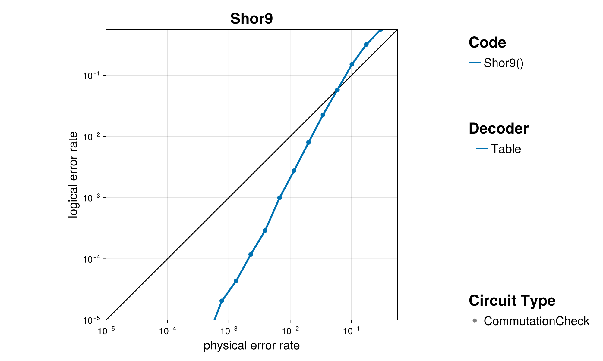

+++
title = "The Code Family `Shor9`"
+++

# The Code Family `Shor9`

One of the earliest proof-of-concept error correcting codes, a concatenation of a 3-bit classical repetition code dedicated to protecting against bit-flips, and a 3-bit repetition code dedicated to protecting against phase-flips.

@@card
@@card-header
References
@@
@@card-body
[ECC Zoo entry](https://errorcorrectionzoo.org/c/shor_nine)~~~ ~~~
[QuantumClifford.jl docs](https://quantumsavory.github.io/QuantumClifford.jl/dev/ECC_API/#QuantumClifford.ECC.Shor9)
@@
@@

## A Few Examples from this Family

@@small
Click on the &#9654; marker to expand
@@

~~~

~~~
### Shor9()
~~~

~~~

#### Parity Check Tableau

.png)

#### Encoding Circuit

@@small
can be generated with [`QuantumClifford.naive_encoding_circuit`](https://quantumsavory.github.io/QuantumClifford.jl/dev/ECC_API/#QuantumClifford.ECC.naive_encoding_circuit)
@@

_encoding.png)

<!-- TODO: Make QASM download for naive encoding circuit -->

#### Naive Syndrome Extraction Circuit

@@small
can be generated with [`QuantumClifford.naive_syndrome_circuit`](https://quantumsavory.github.io/QuantumClifford.jl/dev/ECC_API/#QuantumClifford.ECC.naive_syndrome_circuit)
@@

_naive_syndrome.png)

<!-- TODO: Make QASM download for naive syndrome circuit -->

<!-- #### Shor Syndrome Extraction Circuit -->

<!-- @@small -->
<!-- can be generated with [`QuantumClifford.shor_syndrome_circuit`](https://quantumsavory.github.io/QuantumClifford.jl/dev/ECC_API/#QuantumClifford.ECC.shor_syndrome_circuit) -->
<!-- @@ -->

<!-- TODO: Make QASM download for Shor syndrome circuit -->

~~~

~~~

## Performance of Specific Decoders

TODO
