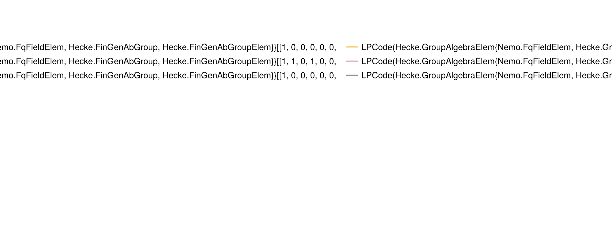

+++
title = "The Code Family `generalized_bicycle_codes`"
+++

# The Code Family `generalized_bicycle_codes`

@@card
@@card-header
References
@@
@@card-body
[ECC Zoo entry](https://errorcorrectionzoo.org/c/generalized_bicycle)~~~ ~~~
[QuantumClifford.jl docs](https://quantumsavory.github.io/QuantumClifford.jl/dev/ECC_API/#QuantumClifford.ECC.generalized_bicycle_codes)
@@
@@

## A Few Examples from this Family

@@small
Click on the &#9654; marker to expand
@@

~~~

~~~
### generalized_bicycle_codes([0, 15, 16, 18], [0, 1, 24, 27], 35)
~~~

~~~

#### Parity Check Tableau

![the parity check tableau of the generalized_bicycle_codes([0, 15, 16, 18], [0, 1, 24, 27], 35) instance of this code family](./generalized_bicycle_codes([0, 15, 16, 18], [0, 1, 24, 27], 35).png)

#### Encoding Circuit

@@small
can be generated with [`QuantumClifford.naive_encoding_circuit`](https://quantumsavory.github.io/QuantumClifford.jl/dev/ECC_API/#QuantumClifford.ECC.naive_encoding_circuit)
@@

![the encoding circuit of the generalized_bicycle_codes([0, 15, 16, 18], [0, 1, 24, 27], 35) instance of this code family](./generalized_bicycle_codes([0, 15, 16, 18], [0, 1, 24, 27], 35)_encoding.png)

#### Naive Syndrome Extraction Circuit

@@small
can be generated with [`QuantumClifford.naive_syndrome_circuit`](https://quantumsavory.github.io/QuantumClifford.jl/dev/ECC_API/#QuantumClifford.ECC.naive_syndrome_circuit)
@@

![the naive syndrome extraction circuit of the generalized_bicycle_codes([0, 15, 16, 18], [0, 1, 24, 27], 35) instance of this code family](./generalized_bicycle_codes([0, 15, 16, 18], [0, 1, 24, 27], 35)_encoding.png)

#### Shor Syndrome Extraction Circuit

@@small
can be generated with [`QuantumClifford.shor_syndrome_circuit`](https://quantumsavory.github.io/QuantumClifford.jl/dev/ECC_API/#QuantumClifford.ECC.shor_syndrome_circuit)
@@

![the Shor syndrome extraction circuit of the generalized_bicycle_codes([0, 15, 16, 18], [0, 1, 24, 27], 35) instance of this code family](./generalized_bicycle_codes([0, 15, 16, 18], [0, 1, 24, 27], 35)_shor.png)

~~~

~~~

~~~

~~~
### generalized_bicycle_codes([0, 15, 16, 18], [0, 1, 24, 27], 35)
~~~

~~~

#### Parity Check Tableau

![the parity check tableau of the generalized_bicycle_codes([0, 15, 16, 18], [0, 1, 24, 27], 35) instance of this code family](./generalized_bicycle_codes([0, 15, 16, 18], [0, 1, 24, 27], 35).png)

#### Encoding Circuit

@@small
can be generated with [`QuantumClifford.naive_encoding_circuit`](https://quantumsavory.github.io/QuantumClifford.jl/dev/ECC_API/#QuantumClifford.ECC.naive_encoding_circuit)
@@

![the encoding circuit of the generalized_bicycle_codes([0, 15, 16, 18], [0, 1, 24, 27], 35) instance of this code family](./generalized_bicycle_codes([0, 15, 16, 18], [0, 1, 24, 27], 35)_encoding.png)

#### Naive Syndrome Extraction Circuit

@@small
can be generated with [`QuantumClifford.naive_syndrome_circuit`](https://quantumsavory.github.io/QuantumClifford.jl/dev/ECC_API/#QuantumClifford.ECC.naive_syndrome_circuit)
@@

![the naive syndrome extraction circuit of the generalized_bicycle_codes([0, 15, 16, 18], [0, 1, 24, 27], 35) instance of this code family](./generalized_bicycle_codes([0, 15, 16, 18], [0, 1, 24, 27], 35)_encoding.png)

#### Shor Syndrome Extraction Circuit

@@small
can be generated with [`QuantumClifford.shor_syndrome_circuit`](https://quantumsavory.github.io/QuantumClifford.jl/dev/ECC_API/#QuantumClifford.ECC.shor_syndrome_circuit)
@@

![the Shor syndrome extraction circuit of the generalized_bicycle_codes([0, 15, 16, 18], [0, 1, 24, 27], 35) instance of this code family](./generalized_bicycle_codes([0, 15, 16, 18], [0, 1, 24, 27], 35)_shor.png)

~~~

~~~

~~~

~~~
### generalized_bicycle_codes([0, 1, 3, 7], [0, 1, 12, 19], 27)
~~~

~~~

#### Parity Check Tableau

![the parity check tableau of the generalized_bicycle_codes([0, 1, 3, 7], [0, 1, 12, 19], 27) instance of this code family](./generalized_bicycle_codes([0, 1, 3, 7], [0, 1, 12, 19], 27).png)

#### Encoding Circuit

@@small
can be generated with [`QuantumClifford.naive_encoding_circuit`](https://quantumsavory.github.io/QuantumClifford.jl/dev/ECC_API/#QuantumClifford.ECC.naive_encoding_circuit)
@@

![the encoding circuit of the generalized_bicycle_codes([0, 1, 3, 7], [0, 1, 12, 19], 27) instance of this code family](./generalized_bicycle_codes([0, 1, 3, 7], [0, 1, 12, 19], 27)_encoding.png)

#### Naive Syndrome Extraction Circuit

@@small
can be generated with [`QuantumClifford.naive_syndrome_circuit`](https://quantumsavory.github.io/QuantumClifford.jl/dev/ECC_API/#QuantumClifford.ECC.naive_syndrome_circuit)
@@

![the naive syndrome extraction circuit of the generalized_bicycle_codes([0, 1, 3, 7], [0, 1, 12, 19], 27) instance of this code family](./generalized_bicycle_codes([0, 1, 3, 7], [0, 1, 12, 19], 27)_encoding.png)

#### Shor Syndrome Extraction Circuit

@@small
can be generated with [`QuantumClifford.shor_syndrome_circuit`](https://quantumsavory.github.io/QuantumClifford.jl/dev/ECC_API/#QuantumClifford.ECC.shor_syndrome_circuit)
@@

![the Shor syndrome extraction circuit of the generalized_bicycle_codes([0, 1, 3, 7], [0, 1, 12, 19], 27) instance of this code family](./generalized_bicycle_codes([0, 1, 3, 7], [0, 1, 12, 19], 27)_shor.png)

~~~

~~~

~~~

~~~
### generalized_bicycle_codes([0, 1, 3, 7], [0, 1, 12, 19], 27)
~~~

~~~

#### Parity Check Tableau

![the parity check tableau of the generalized_bicycle_codes([0, 1, 3, 7], [0, 1, 12, 19], 27) instance of this code family](./generalized_bicycle_codes([0, 1, 3, 7], [0, 1, 12, 19], 27).png)

#### Encoding Circuit

@@small
can be generated with [`QuantumClifford.naive_encoding_circuit`](https://quantumsavory.github.io/QuantumClifford.jl/dev/ECC_API/#QuantumClifford.ECC.naive_encoding_circuit)
@@

![the encoding circuit of the generalized_bicycle_codes([0, 1, 3, 7], [0, 1, 12, 19], 27) instance of this code family](./generalized_bicycle_codes([0, 1, 3, 7], [0, 1, 12, 19], 27)_encoding.png)

#### Naive Syndrome Extraction Circuit

@@small
can be generated with [`QuantumClifford.naive_syndrome_circuit`](https://quantumsavory.github.io/QuantumClifford.jl/dev/ECC_API/#QuantumClifford.ECC.naive_syndrome_circuit)
@@

![the naive syndrome extraction circuit of the generalized_bicycle_codes([0, 1, 3, 7], [0, 1, 12, 19], 27) instance of this code family](./generalized_bicycle_codes([0, 1, 3, 7], [0, 1, 12, 19], 27)_encoding.png)

#### Shor Syndrome Extraction Circuit

@@small
can be generated with [`QuantumClifford.shor_syndrome_circuit`](https://quantumsavory.github.io/QuantumClifford.jl/dev/ECC_API/#QuantumClifford.ECC.shor_syndrome_circuit)
@@

![the Shor syndrome extraction circuit of the generalized_bicycle_codes([0, 1, 3, 7], [0, 1, 12, 19], 27) instance of this code family](./generalized_bicycle_codes([0, 1, 3, 7], [0, 1, 12, 19], 27)_shor.png)

~~~

~~~

~~~

~~~
### generalized_bicycle_codes([0, 10, 6, 13], [0, 25, 16, 12], 30)
~~~

~~~

#### Parity Check Tableau

![the parity check tableau of the generalized_bicycle_codes([0, 10, 6, 13], [0, 25, 16, 12], 30) instance of this code family](./generalized_bicycle_codes([0, 10, 6, 13], [0, 25, 16, 12], 30).png)

#### Encoding Circuit

@@small
can be generated with [`QuantumClifford.naive_encoding_circuit`](https://quantumsavory.github.io/QuantumClifford.jl/dev/ECC_API/#QuantumClifford.ECC.naive_encoding_circuit)
@@

![the encoding circuit of the generalized_bicycle_codes([0, 10, 6, 13], [0, 25, 16, 12], 30) instance of this code family](./generalized_bicycle_codes([0, 10, 6, 13], [0, 25, 16, 12], 30)_encoding.png)

#### Naive Syndrome Extraction Circuit

@@small
can be generated with [`QuantumClifford.naive_syndrome_circuit`](https://quantumsavory.github.io/QuantumClifford.jl/dev/ECC_API/#QuantumClifford.ECC.naive_syndrome_circuit)
@@

![the naive syndrome extraction circuit of the generalized_bicycle_codes([0, 10, 6, 13], [0, 25, 16, 12], 30) instance of this code family](./generalized_bicycle_codes([0, 10, 6, 13], [0, 25, 16, 12], 30)_encoding.png)

#### Shor Syndrome Extraction Circuit

@@small
can be generated with [`QuantumClifford.shor_syndrome_circuit`](https://quantumsavory.github.io/QuantumClifford.jl/dev/ECC_API/#QuantumClifford.ECC.shor_syndrome_circuit)
@@

![the Shor syndrome extraction circuit of the generalized_bicycle_codes([0, 10, 6, 13], [0, 25, 16, 12], 30) instance of this code family](./generalized_bicycle_codes([0, 10, 6, 13], [0, 25, 16, 12], 30)_shor.png)

~~~

~~~

~~~

~~~
### generalized_bicycle_codes([0, 10, 6, 13], [0, 25, 16, 12], 30)
~~~

~~~

#### Parity Check Tableau

![the parity check tableau of the generalized_bicycle_codes([0, 10, 6, 13], [0, 25, 16, 12], 30) instance of this code family](./generalized_bicycle_codes([0, 10, 6, 13], [0, 25, 16, 12], 30).png)

#### Encoding Circuit

@@small
can be generated with [`QuantumClifford.naive_encoding_circuit`](https://quantumsavory.github.io/QuantumClifford.jl/dev/ECC_API/#QuantumClifford.ECC.naive_encoding_circuit)
@@

![the encoding circuit of the generalized_bicycle_codes([0, 10, 6, 13], [0, 25, 16, 12], 30) instance of this code family](./generalized_bicycle_codes([0, 10, 6, 13], [0, 25, 16, 12], 30)_encoding.png)

#### Naive Syndrome Extraction Circuit

@@small
can be generated with [`QuantumClifford.naive_syndrome_circuit`](https://quantumsavory.github.io/QuantumClifford.jl/dev/ECC_API/#QuantumClifford.ECC.naive_syndrome_circuit)
@@

![the naive syndrome extraction circuit of the generalized_bicycle_codes([0, 10, 6, 13], [0, 25, 16, 12], 30) instance of this code family](./generalized_bicycle_codes([0, 10, 6, 13], [0, 25, 16, 12], 30)_encoding.png)

#### Shor Syndrome Extraction Circuit

@@small
can be generated with [`QuantumClifford.shor_syndrome_circuit`](https://quantumsavory.github.io/QuantumClifford.jl/dev/ECC_API/#QuantumClifford.ECC.shor_syndrome_circuit)
@@

![the Shor syndrome extraction circuit of the generalized_bicycle_codes([0, 10, 6, 13], [0, 25, 16, 12], 30) instance of this code family](./generalized_bicycle_codes([0, 10, 6, 13], [0, 25, 16, 12], 30)_shor.png)

~~~

~~~

## Performance of Specific Decoders

TODO

